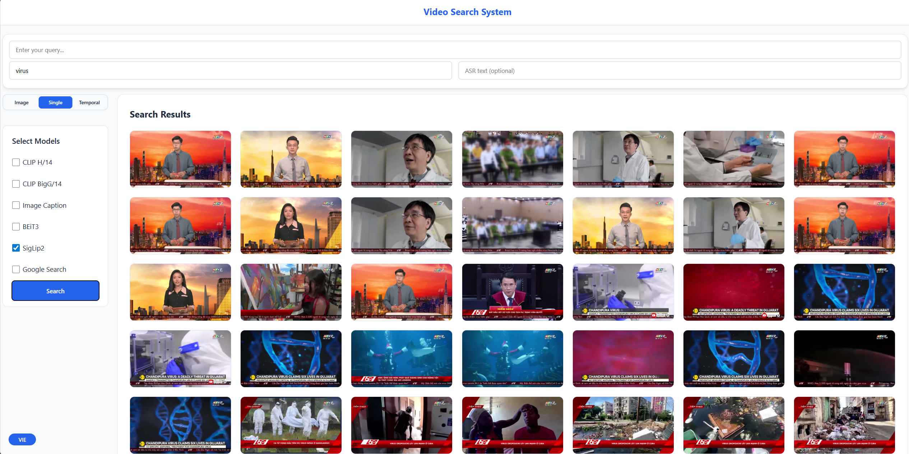
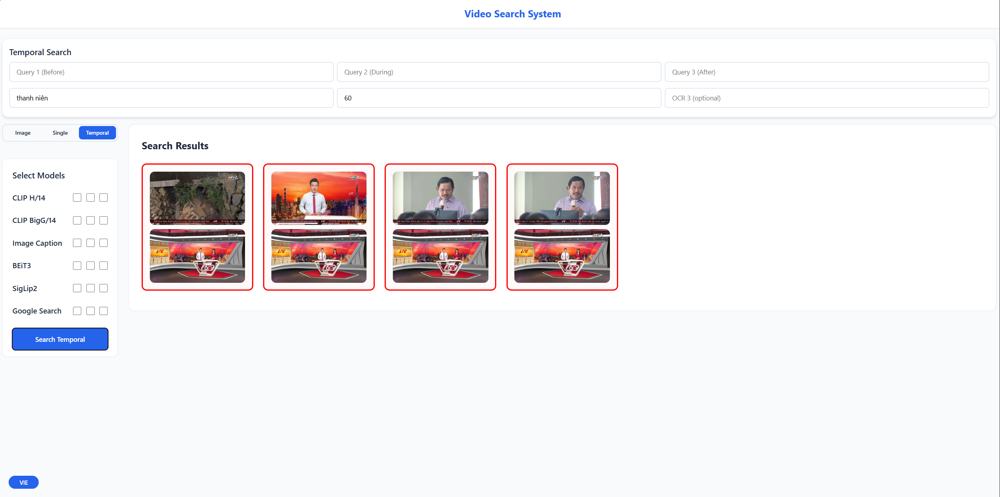

# AI Video Search System – CS336

An AI-powered video search system using vector databases and multimodal models
to retrieve relevant video keyframes from text-based queries.

---

## Technologies Used

Backend:
- FastAPI (Python)
- Milvus Cloud (Zilliz)
- Elasticsearch 8.18.4
- PyTorch 2.3.0 (CUDA 12.1)

AI Models:
- CLIP H/14 Quick GELU (1024-dim)
- CLIP BigG/14 DataComp (1280-dim)
- BEIT3 (1024-dim)
- SigLip2 (1536-dim)
- Image Captioning (PhoWhisper Large, optional)
- Google Gemini (optional)

Frontend:
- Vanilla JavaScript (ES6)
- CSS Grid, Responsive UI
- Modal-based video preview

Infrastructure:
- Docker Compose
- Nginx

---

## How It Works

1. Video keyframes are encoded into vector embeddings using AI models.
2. Embeddings are stored in Milvus vector collections.
3. Text queries are converted into embeddings.
4. Vector similarity search retrieves relevant keyframes.
5. Results are rendered in the UI with video preview support.

---

## Usage

Single Search:
- Enter a text query.
- Select one or more models.
- Choose language (VIE / ENG).
- View results as a grid of keyframes.

Temporal Search:
- Enter three time-ordered text queries.
- Select models per query.
- View grouped keyframe sequences.

Image Search:
- Upload an image.
- Retrieve visually similar keyframes.

Video Preview:
- Click a keyframe to open the preview modal.
- Video plays at the matched timestamp.

---

## Demo

Results are displayed as a grid of relevant keyframes with similarity scores.

### Temporal Search

Temporal search allows you to find sequences of keyframes matching time-ordered queries.

### Video Preview Modal

Click any keyframe to open the video player modal, which jumps directly to the matched timestamp.

---

## Running the System

### Configure .env

Create a `.env` file in the project root:

ENV FILE CONTENT:
--------------------------------------------------
ZILLIZ_CLOUD_URI=https://xxx.zillizcloud.com
ZILLIZ_CLOUD_TOKEN=xxxxxxxxxxxxxxxxxxxxx

GEMINI_API_KEY_1=AIzaSyXXXXXXXXXXXXXXXXX
GEMINI_API_KEY_2=AIzaSyXXXXXXXXXXXXXXXXX
GEMINI_API_KEY_3=AIzaSyXXXXXXXXXXXXXXXXX

COHERE_API_KEY=xxxxxxxxxxxxxxxxxxxxx
--------------------------------------------------

NOTES:
- ZILLIZ_CLOUD_URI and ZILLIZ_CLOUD_TOKEN are REQUIRED.
- Gemini and Cohere keys are OPTIONAL.
- Only add optional keys if those features are enabled.

---

### Start with Docker Compose

COMMANDS:
--------------------------------------------------
docker compose up -d --build
docker compose logs -f web
--------------------------------------------------

---

### Open the Application

URL:
--------------------------------------------------
http://localhost:8111
--------------------------------------------------

---

## License

MIT License.

---

## Contact

Project Owner: Trong Hoang  
Email: tronghph@gmail.com  
Course: CS336 – Multimedia Information Retrieval
